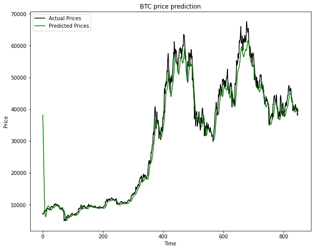
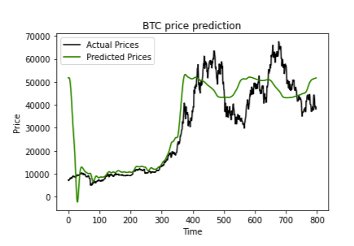
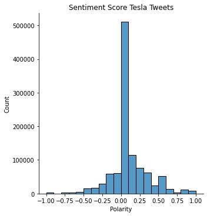
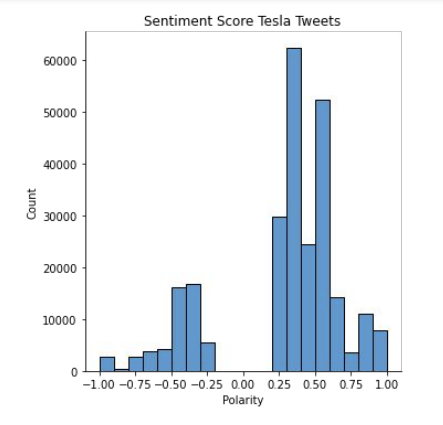
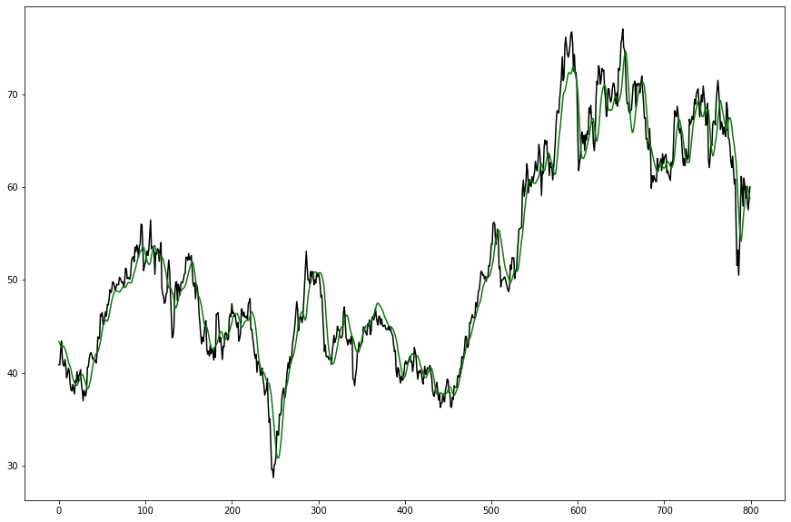

# Stock Market Prediction
## Data Science II Project
### by Seth Hodgkins
### Overview
- Fluctuations in stock prices are diffucult to predict
- Machine learning has become a popular option
### Objectives
- To explore the effectiveness of different machine learning strategies
- To find data that can help predict stock prices
### Method 1
#### *Neural Network*
In this first approach, I gave a neural network historical stock closing prices, and asked it the predict the closing price one day in the future. More specifically, I gave it 30 day windows, and asked it to predict the 31st day.
```
prediction_days = 30
X_train, y_train = [], []
for x in range(prediction_days, len(scaled_data)):
    X_train.append(scaled_data[x-prediction_days:x, 0]) # 30 day window (x-30 to x) as training data
    y_train.append(scaled_data[x, 0])
```
I used a sequential network with LSTM layers, and dropout between each one.
```
model = Sequential()
model.add(LSTM(units=50, return_sequences=True, input_shape=(X_train.shape[1], 1)))
model.add(Dropout(0.2))
model.add(LSTM(units=50, return_sequences=True))
model.add(Dropout(0.2))
model.add(LSTM(units=50))
model.add(Dropout(0.2))
model.add(Dense(units=1))

model.compile(optimizer='adam', loss='mean_squared_error')
model.fit(X_train, y_train, epochs=25, batch_size=32)
```
The results weren't great. It seemed to just predict what had already happened.



I tried increasing the window to 120 days, as well as making it predict the next 30 days. I hoped this would force it to make predictions rather than just repeat what happened last, but it didn't work well.



### Method 2
#### *Twitter Sentiment Analysis*
In this next method, I take thousands of tweets that mention the stock I’m interested in, and use a language processing tool to find whether the author talks about the stock positively or negatively. With these scores, I can try to find a relationship between stock movement of a company, and public opinion towards that company. Here's the distribution of polarity for tesla, which expresses how positive (+1) or negative (-1) a statement is.



I decided to remove the large amount of neutral tweets from the center. I thought more extreme data might help with the regression.



In order to combine sentiment data with tesla's stock price data, I decided to aggregate tweets into a daily polarity score.

`polarity_date = tsla[['post_date', 'polarity']].groupby('post_date').mean()`

I could now merge the two tables.

`tsla_final = tesla_close.merge(polarity_date, how="left", on="Date").dropna()`

#### *Random Forest with closing price and tweet polarity*

Next, I used RandomForestRegressor to quickly determine if there was a relationship between close price and polarity. The results were very poor. It overfit on the training set, scoring .82, and then found a negative coorelation on the test set, -0.23.
 #### *Random Forest with daily stock price change and tweet polarity*

 I thought there might be a better relationship between price between when a stock opens and closes in a day and and polarity. Closing price alone doesn't capture whether a stock is actively improving or not.

 ```tsla['Change'] = tsla['Open']-tsla['Close']```

 I used GridSearchCV with cross validation, to try to find the best hyperparameters and to avoid overfitting.

 ```
 param_grid = {
    'bootstrap': [True],
    'max_depth': [80, 90, 100, 110],
    'min_samples_leaf': [3, 4, 5],
    'min_samples_split': [8, 10, 12],
    'n_estimators': [100, 200, 300, 1000]
}

from sklearn.ensemble import RandomForestRegressor
from sklearn.model_selection import GridSearchCV

rf = RandomForestRegressor()
grid_search = GridSearchCV(estimator = rf, param_grid = param_grid, 
                          cv = 3, n_jobs = -1, verbose = 2)

grid_search.fit(X_train, y_train)
```

Despite my efforts, it didn't find a correlation. It scored 0.41 on the training set, and -0.07 on the test set.

#### *Neural Network with multiple stock and twitter sentiment features*

At this point, I decided to just throw everything I had collected at a neural network and see it works better. I went and generated the data again, this time not removing neutral tweets. I also added subjectivity, another type sentiment score which determines whether the statement is factual or opinion based. For the inputs, I used close price, daily change in price, polarity, and subjectivity.

`X.append(tsla[['Close', 'Change', 'subjectivity', 'polarity']]`

It should output it's prediction for a close price. I used the same system as in method one, with windows of 30 days.



It seems like there was not much of an improvement on method 1. It still outputs an offset version of the actual prices, meaning it's not really making predictions.

### Conclusion
None of the models I created were effective. I think I tried too many different approaches, without diving in to one of them far enough to produce good results. It was still a good experience however and taught me a lot about time series data analysis with python.

### References
- https://www.kaggle.com/datasets/omermetinn/tweets-about-the-top-companies-from-2015-to-2020
- https://www.youtube.com/watch?v=GFSiL6zEZF0&t=1641s&ab_channel=NeuralNine
- https://www.geeksforgeeks.org/twitter-sentiment-analysis-using-python/
